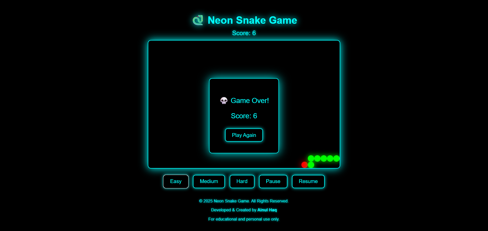

# 🐍 Snake_Game


A **modern Snake_Game** built using **HTML, CSS, and JavaScript**.  
Play the classic Snake 🐍 game in a glowing neon world with **difficulty levels, pause/resume, and score tracking**.  

👉 **[🎮 Play Live Demo on Vercel](https://snake-game-beta-swart.vercel.app/)**  

---

## 🚀 Features

- 🎨 **Neon UI** – Glowing snake, food, and UI with futuristic style.  
- 🎮 **3 Difficulty Levels** – Easy 🐢 | Medium ⚡ | Hard 🔥  
- ⏸️ **Pause & Resume** anytime.  
- 💀 **Game Over Screen** with Restart option.  
- 📊 **Real-time Score Tracking**.  
- 🖥️ Runs directly in your browser – No installation required.  
- 📝 **Created with ❤️ by Mohd Kaif**.  

---

## 🖼️ Preview



---

## 🛠️ How to Play

1. **Controls:**  
   - ⬆️ Up | ⬇️ Down | ⬅️ Left | ➡️ Right  
2. Eat **red food** 🍎 to grow & score points.  
3. Avoid hitting the **walls** or your own body.  
4. Choose difficulty before starting:  
   - Easy 🐢 – Slow  
   - Medium ⚡ – Balanced  
   - Hard 🔥 – Fast  
5. Use **Pause/Resume** buttons anytime.  

---

## ⚙️ Installation & Usage

1. Clone the repo:
   ```bash
   git clone https://github.com/mohdkaif67/Snake_Game/tree/main


